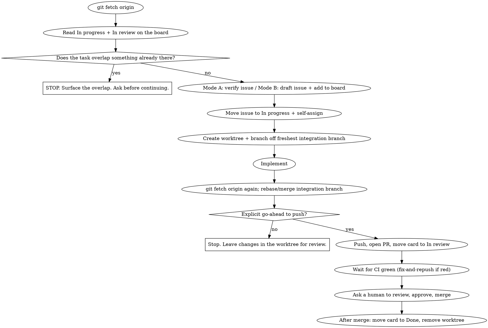

# Co-development workflow

## Cached values for this repo

Resolved once so future sessions skip auto-detection (re-verify with the CLI if they look stale):

- Repo: `patr7257/MiniGames` (public). Integration + production branch: `main` (no `dev` branch).
- Board owner: `patr7257`. Board: `MiniGames dev board`, project number `6`, id `PVT_kwHOCbc9N84BdlAg`.
- Status field id `PVTSSF_lAHOCbc9N84BdlAgzhYFkYY`, options: Todo `f75ad846`, In Progress `47fc9ee4`, Done `98236657`.
- Personal repo: author commits as `patr7257@gmail.com` (set `git config user.email patr7257@gmail.com` locally). Use `gh auth switch -u patr7257`.

## Overview

Multiple developers and multiple agent sessions share one repository. Without coordination,
two people start the same thing and merge conflicts pile up. This skill makes work
issue-first and board-synced so everyone can see who is doing what.

**The core rule:** No code changes begin until the task exists as a GitHub issue that is in
the **In progress** column and assigned to you, and you have confirmed nobody else is already
on it. Then work happens in its own git worktree branched off the freshest integration branch,
and lands through a pull request that a human reviews and merges.

**Violating the letter of this rule is violating the spirit of it.** "I'll make the issue
after" or "this change is too small to track" defeats the whole purpose, which is that the
board always reflects reality. The one legitimate way to skip the workflow is an explicit
developer decision (see Step zero) - the agent never makes that call on its own.

## Step zero: ask the developer whether to use this workflow

Before any task that would change files in the repo, ask the developer whether to run this
co-development workflow for it or to skip it. Full issue-first, board-synced, worktree-isolated
handling is the right default for anything non-trivial, but for a small or fast change it can be
overkill. **That trade-off is the developer's to make, not the agent's.** Do not silently assume
either way, and do not rationalize skipping because the change "looks small": ask, let the
developer choose, and record their answer.

- **Use it** -> proceed with the loop below (clash-check, claim the issue, worktree, PR).
- **Skip it** -> implement directly, without the issue/board/worktree ceremony, on whatever
  branch the developer directs.

A repo may enforce this stop mechanically (see Enforcement below) so the question is never
skipped by accident.

## Model selection (orchestrator and subagents)

Two separate decisions: which model runs THIS session (the orchestrator), and which model each
subagent runs. They live in different places.

**Orchestrator (this main session): ask the developer at the start; you cannot switch it yourself.**
A skill runs inside the session's existing model and has no way to change it mid-session, so this is
a question for the developer, not an action you take. At the start of a multi-issue or otherwise
heavy co-dev session, ASK which orchestrator model they want, explain the trade-off, and if they are
not already on it have them switch with `/model` (or set `"model"` in the repo's
`.claude/settings.json`). Recommend by how hard the coordination is:

- **Opus 4.8 (`/model opus`): the default.** Very capable at planning, integration, review, and
  running the live/DB stack, and cheaper than Fable (about $5/$25 per Mtok).
- **Fable 5 (`/model fable`): the hardest, highest-stakes runs.** Anthropic's most capable model for
  long-horizon multi-agent coordination, but the most expensive (about $10/$50) and slower
  (always-on deeper thinking). Choose it when several interacting issues, tricky migrations, or a
  large refactor make orchestration itself the bottleneck; otherwise Opus is the better
  cost-and-speed balance.

Do not assume; ask, and record the answer, in the same spirit as Step zero.

**Implementation subagents: you DO choose their model, on every dispatch.** Pass the model
explicitly each time you spawn one. An omitted model silently inherits the orchestrator's tier,
which is the expensive one, so never leave it off. Default low and escalate on evidence:

- **Sonnet 5 (`model: sonnet`): the default for implementation.** Near-Opus coding and agentic
  quality at a fraction of the cost (about $3/$15, intro $2/$10). The right tier for a well-scoped
  issue whose brief spells out the files, conventions, and skills to use.
- **Opus 4.8 (`model: opus`): upgrade when the task needs more.** Architectural judgment, broad
  cross-file reasoning, an ambiguous spec, or a subagent that came back BLOCKED or produced a weak
  diff. Re-dispatch that task on `opus` rather than making `sonnet` retry the same wall.
- **Haiku 4.5 (`model: haiku`): trivial mechanical edits** (a rename, a verbatim transcription).

Start at Sonnet 5 and escalate on evidence, not on guesswork; the review step (a human, plus any
review subagent) catches a too-cheap choice.

**While subagents run, the orchestrator keeps working, it does not idle.** Dispatch implementers in
the background and, in the meantime, do the next useful thing: draft the next issue's brief, read
the board, prepare the integration branch, or review a diff that already came back. Block only when
a step genuinely depends on a subagent's result (the frontend brief needs the finalized contract;
the integration needs the diffs). This keeps the expensive orchestrator busy instead of paying it
to wait.

## How we work (for developers, plain language)

If you are a teammate reading this to understand our process, here it is:

1. Every piece of work is a GitHub issue. The Projects board is the single source of truth for
   who is doing what. Look at the board before you start anything.
2. You start a task in one of two ways. Either point the agent at an existing issue ("work on
   issue #19"), or just describe what you want ("the mobile landing page looks zoomed in, fix
   it"). If you describe it, the agent creates the issue for you and shows it to you.
3. The agent moves the issue to **In progress** and assigns it, so the rest of the team sees it
   is taken. It works on an isolated copy of the repo (a git worktree) so it never disturbs
   your other in-flight files or git history. (Worktrees isolate files and git state, not
   shared host resources like dev-server ports or the database - see the caveat in step 6.)
4. When the work is ready, the agent opens a pull request and the board card moves to
   **In review**. After the automated checks pass, you (a human) review, approve, and merge.
   The agent never merges and never touches the production branch.

That is the whole loop. The rest of this document is how the agent executes it precisely.

## First-run setup (once per machine)

Reading and moving board cards needs the GitHub CLI with the `project` scope. Issue commands
work without it, but column moves do not. Run once and complete the browser prompt:

```
gh auth refresh -s project
```

Verify with `gh project list --owner <OWNER>`: the board should appear. Detailed commands are
in [github-projects-cli.md](references/github-projects-cli.md).

## Enforcement (decision gate hook)

This repo backs Step zero with a `PreToolUse` hook (`.claude/hooks/codev-gate.py`, wired in
`.claude/settings.json`) so the agent cannot edit project files until the developer's use-or-skip
decision is recorded. It works for the main checkout and for sibling `<repo>-<issue#>` worktrees;
writes outside the repo (scratchpad, temp) are never gated.

On the first edit attempt in a session the hook denies the write and returns the current
`session_id`. The agent then asks the developer (Step zero), and records the answer by APPENDING
a line `<session_id> use|skip` (LF endings) to `.claude/.codev-ack` (gitignored). The file holds
ONE LINE PER SESSION so parallel agent sessions in the same repo never clobber each other's
decision: never overwrite or remove another session's line. Subsequent edits in that session are
allowed; a new session has a new id, so the gate re-engages and the question is asked again. A
per-prompt reminder (`UserPromptSubmit` hook) nudges the agent to re-confirm when a new task
begins within the same session - remove your session's line to force the question again
mid-session.

Hard-won lesson (2026-07-06): the original gate matched only the FIRST line's session id, so two
parallel sessions kept rewriting the whole file to hold their own single line and ping-ponged
each other into denial. The hooks now match per line; agents must append, never rewrite.

## Two entry modes

| Mode | The user says | What it means |
|---|---|---|
| A. Existing issue | "work on issue #N", "pick up the RBAC issue", or names an issue you created earlier | Pointing at the issue is the go-ahead. Verify it, clash-check, claim it. |
| B. Describe a task | "fix the zoomed-in mobile pages", "add a calendar filter" | Describing it is the go-ahead. Clash-check, draft the issue, show it, then claim it. |

In both modes, the user describing or pointing is authorization to set up (issue, board move,
worktree, branch). It is NOT authorization for outward git actions (push, PR, merge), which
always need a fresh explicit instruction in that turn.

## The loop



### A. Gate (before ANY work, both modes)

1. `git fetch origin` first, always. Treat `origin/*` as the source of truth, never the local
   copy.
2. Read the board's current **In progress** and **In review** items. If the task overlaps one,
   STOP and surface it rather than duplicating effort. When in doubt, ask.
3. Resolve the issue. Mode A: confirm the pointed-to issue exists; if it has no card on the
   board yet, add it first; if it is already In progress or assigned to someone else, STOP and
   surface it rather than claiming it. Mode B: draft a clear issue (title prefixed `feat:` /
   `fix:` / `chore:`, a short body of intent and scope), add it to the board, and show it to
   the user.
4. Move the issue to **In progress** and assign it to yourself, then re-read the card to
   confirm the claim stuck (no other assignee appeared in a race); if someone else now holds
   it, stop and surface it. Each developer and each agent session must authenticate as its own
   GitHub identity so the assignee shows who is actually working. If the team shares one machine
   account, also record the human owner in an issue comment so ownership stays unambiguous.

### B. Start the work

5. Create an isolated worktree off the freshest integration branch, one per issue:
   `git worktree add ../<repo>-<issue#> -b feat/<topic> origin/<integration-branch>`. Branch
   names use `feat/` `fix/` `chore/`. The worktree keeps this task from colliding with other
   sessions or your other in-flight branches.
   - **Prepare the worktree before building - a fresh worktree is not ready to run.** It has no
     `node_modules` (dependencies are not shared between worktrees) and none of the repo's
     gitignored files. Run the install (`pnpm install`) in the new worktree, and seed any
     gitignored env the build or tests need: cd into the worktree, then
     `node C:/Users/pr/.claude/scripts/env-tools.mjs seed` (copies .env* from the primary
     checkout without exposing values; stays gitignored, never committed). Skipping
     this fails fast and confusingly: `'turbo' is not recognized` / missing `node_modules`, or
     tests blowing up because the DB helper has no `DATABASE_URL`. Only prepare, then implement.
6. Implement, following the repo's own conventions (contract-first, tests, server-side rules,
   and so on where the repo defines them).
   - **Carry over any pre-claim edits.** If you already changed files in the main checkout
     before claiming the issue, copy them into the worktree and revert the main checkout, so
     the work lives only on the branch.
   - **cwd note (Bash tool):** the Bash tool resets the working directory to the main checkout
     after every command, so target the worktree by absolute path or `cd` into it at the start
     of each command. It is a path thing, not a state thing. But keep the SESSION cwd at the
     repo root: a trailing `cd` into a subdir or sibling worktree that persists across calls can
     make the decision-gate hook resolve `.claude/.codev-ack` against the wrong directory and
     then block ALL edits until you `cd` back to the repo root.
   - **A worktree isolates files and git state, NOT host ports, running processes, or the
     shared database.** Two checkouts cannot both bind the same dev-server port (`:5173` /
     `:3000`): whichever started first wins and the other fails quietly, so you end up
     screenshotting stale code from the wrong checkout. Before starting a dev server from a
     worktree, free the port (kill the existing listener), and once it boots confirm the server
     log shows the worktree's path, not another checkout's. `pnpm --filter` resolves the
     workspace from your current directory, so verify you are actually inside the worktree. The
     dev/test Postgres is a single shared instance: migrating or seeding from a worktree mutates
     the same DB the primary checkout uses.
   - **The main/orchestrator session usually cannot Edit/Write files inside a sibling worktree;
     spawned subagents can.** The session's file tools are sandboxed to the primary checkout, so
     Edit/Write to `../<repo>-<issue#>` are denied for the main agent (Bash and `git` still
     operate outside the sandbox - that is how the worktree gets created and `pnpm install`ed).
     The pattern that works for parallel work: dispatch ONE subagent per worktree to do that
     issue's edits (subagents are not bound by the main session's sandbox), and orchestrate,
     integrate, and run the live/DB-backed tests from the main checkout. See "Parallel
     multi-issue work" below.

### C. Open the PR (outward steps, gated)

7. `git fetch origin` again and rebase or merge the integration branch so the branch is
   current before review. If the repo uses ordered migrations and this branch added or changed
   one, regenerate it after the rebase (see the repo's database skill, for this repo the
   `drizzle` skill).
8. Only on an explicit per-turn instruction from a human: push the branch, open the PR against
   the integration branch (never the production branch), and move the card to **In review**.
9. Wait for CI to go green (`gh pr checks <#> --watch`). If it is red, fix on the same branch
   and push again.
10. Once green, ask a human to review, approve, and merge. Never self-merge. After the merge,
    move the card to **Done**, then clean up: stop any dev servers or processes you (or your
    subagents) started - free EVERY dev port that may be held (`:5173`, `:5174`, `:3000`,
    `:3001`), not just one; worktree removal does NOT stop them. Identify each listener's process
    command line before killing it and never kill a server from another checkout or another
    project on the machine. Then remove the worktree (`git worktree remove --force`, since it
    carries untracked `.env` / `node_modules`); on Windows a locked `node_modules` can need a
    follow-up `Remove-Item -Recurse -Force` on the directory after its processes are killed.

## Parallel multi-issue work (integration-branch pattern)

When two or more issues must land together - especially if they touch the same schema, the same
contract file, or both add an ordered migration - running them as fully independent PRs causes
avoidable collisions. Use an integration branch:

1. In the MAIN checkout, cut an integration branch off `origin/<integration-branch>` (e.g.
   `feat/<topic>-integration`) and keep it checked out there. This is where YOU run the full
   local stack, the live tests, and the Playwright review - sibling worktrees lack the gitignored
   `.env`, so they cannot run the DB-backed stack.
2. Cut each issue's worktree off the integration branch and dispatch one subagent per worktree to
   implement it (subagents can edit worktrees; the main session cannot - see step 6). Give each
   subagent strict, disjoint file ownership; where they must share one file (a schema, a contract),
   have them make only additive changes and document the seam so the merge is trivial.
3. Subagents commit on their branches (committing is authorized when the task says so) but do NOT
   push/PR. The orchestrator reviews each diff, then integrates into the integration branch in the
   main checkout (merge, or PR each branch into it), resolving the additive conflicts.
4. Ordered migrations: if two branches both add one they collide on the next number. Merge one
   first, then regenerate the other's migration so it re-chains as the next number with a fresh
   timestamp (see the repo's database skill). Never hand-renumber.
5. Verify the integrated result in the main checkout (full local + visual), then open ONE PR from
   the integration branch into `dev` (linking/closing each issue), or per-issue PRs if the team
   wants granular review (more work: re-separating re-creates the conflicts you already resolved).
   A human reviews and merges; never self-merge to `dev`.

### Example kickoff and the orchestration checklist

The developer can trigger all of this with a minimal prompt, for example:

> "Use the co-dev skill to handle issues #62, #70 and #72 this session."

That short trigger means: run the FULL flow below. Do not wait for a detailed spec; this skill IS
the spec. Expand the trigger into:

1. **Sync + understand.** `git fetch origin`; confirm `dev` is current (a co-developer may be
   pushing). Read each issue and clash-check the board's In progress / In review. If an issue's
   description is too thin to build confidently, interview the developer WITH recommendations
   before coding; surface any contradiction with already-shipped work (escalate and ask, do not
   silently flag).
2. **Plan first.** Give the developer a short combined overview before any code: per-issue scope,
   how the issues interact, which files / contracts / migrations they SHARE, and the disjoint
   file-ownership split you will enforce. Wait for go-ahead on the plan.
3. **Set up (main checkout).** Cut one integration branch off `origin/dev`
   (`feat/<topic>-integration`) and keep it checked out here. Per issue:
   `git worktree add ../<repo>-<issue#> -b <type>/<topic> <integration-branch>`, then in each
   worktree run `pnpm install` and seed the gitignored `.env` from the main checkout
   (cd into the worktree, then `node C:/Users/pr/.claude/scripts/env-tools.mjs seed`).
4. **Dispatch one subagent per issue, in parallel.** In EACH subagent prompt: name the issue and
   its worktree absolute path; name the EXACT skills to use (subagents are weak at proactive skill
   use, so spell them out, e.g. `drizzle` for schema/migrations, `vitest` for tests,
   `ui-ux-pro-max` for UI); state the disjoint file ownership and that any shared file gets
   additive-only edits; restate the repo conventions (contract-first, server-side guards, no
   emojis, no dash-as-punctuation); and tell it to COMMIT on its branch but NOT push/PR, leaving
   live/DB testing to the orchestrator. A subagent may use several skills for its one issue.
   Spawn each on `model: sonnet` by default and escalate a hard or ambiguous issue to `model: opus`
   (see Model selection); pass the model explicitly so it never inherits the orchestrator's tier.
5. **Integrate + verify (main checkout).** Review each diff. Merge the branches into the
   integration branch, resolving the additive conflicts; if two added migrations collided, land
   one then regenerate the other (see the database skill). Run the full local stack + the
   Playwright review HERE (worktrees cannot, no `.env`). Fix-forward through the owning subagent.
6. **Land.** Only on an explicit per-turn go-ahead: push and open ONE PR from the integration
   branch into `dev` (or per-issue PRs if asked), wait for CI green, hand to a human to merge.
   After merge: cards to Done, free every dev port, remove worktrees, delete merged branches,
   delete screenshots.

**Traps this flow already prevents (learned the hard way, do not rediscover them):**
- The main/orchestrator session cannot Edit/Write sibling worktrees; subagents can. Never try to
  edit a worktree from the orchestrator; dispatch a subagent.
- Keep the Bash session cwd at the repo ROOT, or the co-dev decision-gate hook blocks all edits.
- Before testing, free EVERY dev port (`:5173`, `:5174`, `:3000`, `:3001`) and confirm the live
  server's process command line points at the checkout you mean to test; a stale worktree server
  serves OLD code. Identify a process before killing it and never kill another project's server.
- Two branches that both add a migration collide on the number: land one, regenerate the other;
  never hand-renumber.
- Delete `apps/web/e2e/.screenshots` + `apps/web/test-results` after use; never upload them.
- Never commit on `dev` / `main`, never self-merge, never push / open a PR without a fresh
  per-turn go-ahead.

## Board lifecycle

`Backlog -> (Ready) -> In progress -> In review -> Done`

- **Backlog**: not started. **Ready** (optional): groomed, safe to pick up next. Pull new work
  from Ready first, otherwise Backlog.
- **In progress**: actively being worked, assigned to one person. This is what others read to
  avoid double work, so move the card here the moment you start, not at the end.
- **In review**: a PR is open. **Done**: merged.

## Auto-detection (works in any repo, nothing hardcoded)

- Owner and repo: `gh repo view --json owner,name,defaultBranchRef`.
- Integration branch: prefer `origin/dev` if it exists, otherwise the repo default branch.
  Treat `main` / `master` as production: never branch feature work onto it, never push to it.
  A repo may override the integration branch in its own instructions file.
- Board: do NOT assume a board exists. Look for it with `gh project list --owner <OWNER>`. The
  board owner can differ from the repo owner: a board is often a personal user project that
  tracks an org repo's issues (ownership transfers do not always carry your access), so also
  check the owner the repo's instructions file records. If you find exactly one board, use it;
  if several, ask the user which. If you find none, or cannot access the expected one, STOP and
  ask the user for the board URL, and create a new board only if they confirm.
- Status field and column IDs differ per board: read them with
  `gh project field-list <N> --owner <BOARD_OWNER> --format json`; never assume IDs from
  another repo.

The repo's own instructions file (CLAUDE.md or AGENTS.md) is the place to cache the resolved
repo owner, board owner, board number, integration branch, and column IDs once discovered.

## Quick reference

| Need | Command (detail in references/github-projects-cli.md) |
|---|---|
| Detect repo + default branch | `gh repo view --json owner,name,defaultBranchRef` |
| List boards for an owner | `gh project list --owner <OWNER>` |
| Read columns + their IDs | `gh project field-list <N> --owner <OWNER> --format json` |
| See current In progress | `gh project item-list <N> --owner <OWNER> --format json` then filter Status |
| Create an issue | `gh issue create --repo <OWNER>/<REPO> --title "..." --body "..."` |
| Add an issue to the board | `gh project item-add <N> --owner <OWNER> --url <ISSUE_URL>` |
| Move a card to a column | `gh project item-edit --id <ITEM> --project-id <PID> --field-id <FID> --single-select-option-id <OID>` |
| Make the worktree + branch | `git worktree add ../<repo>-<issue#> -b feat/<topic> origin/<int-branch>` |
| Open the PR | `gh pr create --base <int-branch> --fill` |
| Watch CI | `gh pr checks <#> --watch` |

## Guardrails (never)

- Never start changing code before the issue is In progress and assigned to you.
- Never skip the board read. The whole point is to see who is doing what before you act.
- Never commit, push, open a PR, or merge without an explicit human instruction in that turn.
  Finishing the implementation is not implicit permission.
- Never touch the production branch (`main` / `master`): no commits, no pushes, no merges.
- Never push your own work directly to the integration branch; changes land only through a PR.
- Never self-merge a PR. A human reviews, approves, and merges.
- Never share a working tree with another in-flight task: one worktree per issue.

## Red flags, STOP

If you catch yourself thinking any of these, stop and return to the loop:

- "I'll create the issue after I finish the change."
- "This is too small to need an issue."
- "The board check is overkill for this one."
- "I can work in the current checkout, it is probably fine."
- "I finished, so I will just push and open the PR."
- "Local dev looks up to date, I do not need to fetch."

## Rationalizations and reality

| Rationalization | Reality |
|---|---|
| "Too trivial for an issue" | Trivial work still collides and still needs a trail. All work gets an issue. |
| "I'll move the card to In progress at the end" | Then nobody could see it was taken. Move it when you start. |
| "Describing the task is not approval to push" already done? | Correct, and that is the point: setup is authorized, pushing is not. Ask before pushing. |
| "Skipping the fetch saves time" | A branch cut from a stale base causes exactly the conflicts this skill prevents. Fetch first, always. |
| "I'll reuse the current branch/worktree" | That is how you clobber another session's work. One worktree per issue. |
| "CI will probably pass, I'll ask for merge now" | Ask for review only after CI is green. Red CI wastes the reviewer's time. |
| "The subagent can just inherit my model" | An omitted model runs the subagent on the expensive orchestrator tier. Pass `model: sonnet` and escalate to `opus` only on evidence. |
| "I'll wait for the subagent before doing anything else" | Idle orchestrator time is wasted spend. Prep the next brief, board read, or integration branch while it runs; block only on a real dependency. |

## Common mistakes

- Cutting the branch from local `dev` instead of `origin/dev` after a fetch. Always base on
  `origin/<integration-branch>`.
- Creating a draft project item instead of a real repo issue. Use `gh issue create` then
  `gh project item-add --url`; `gh project item-create` makes a board-only draft.
- Forgetting to re-sync with the integration branch before the PR, so the PR shows stale
  conflicts.
- Leaving stale worktrees behind. Remove the worktree after the merge.
- Starting a dev server from a worktree while a stale server from another checkout still holds
  the port, so you view and screenshot old code. Free the port first and confirm the server
  log shows the worktree's path.
- Treating a fresh worktree as ready to run. Install dependencies and copy the gitignored env
  it needs first (see step 5).

## Related

- The repo's own git rules and conventions in its instructions file (CLAUDE.md / AGENTS.md):
  the authority on the integration branch, presentation standards, and when pushing is allowed.
- The repo's database skill for regenerating ordered migrations after a rebase (for this repo,
  the `drizzle` skill).
- The handoff-note convention for work that must carry over to another developer or phase.
- [github-projects-cli.md](references/github-projects-cli.md) for the exact `gh` commands,
  including how to discover field and option IDs and move cards.

## Propagating this skill to a project (keep team copies in sync)

This skill (`personal-updated-co-dev-workflow`) is **your personal, always-latest master**, living at
`~/.claude/skills/` and available in every session. Project-level copies live at
`<repo>/.claude/skills/co-development-workflow/` and are what teammates pick up. Keep them converging on
this one source of truth:

**Whenever you start using this workflow in a repo, ASK the user first (never auto-copy):**
> "Want me to install/update this repo's project-level `co-development-workflow` skill from your latest
> personal master, so your coworkers get the newest version? (yes / no)"

- **If yes:** copy this skill's two files into the repo under the canonical name
  `co-development-workflow` (NOT the personal name):
  - `<repo>/.claude/skills/co-development-workflow/SKILL.md`
  - `<repo>/.claude/skills/co-development-workflow/references/github-projects-cli.md`
  Overwrite any existing project copy; in the copied `SKILL.md` set frontmatter `name:` back to
  `co-development-workflow`; replace the cookbook's `## Cached values for this repo` block with THIS
  repo's real board IDs (rediscover via sections 2-3). Then, per this very workflow, offer to commit
  it on a branch + PR (`chore: sync co-development-workflow skill`) so teammates get it on merge.
- **If no:** leave the project copy untouched; just use this master for the session.

**Improving the skill:** when you learn a new co-dev lesson, add it HERE (the master) first, then offer
to re-sync into the project copies with the same ask. Don't edit project copies directly and let them
drift. Edit the master, then propagate.
